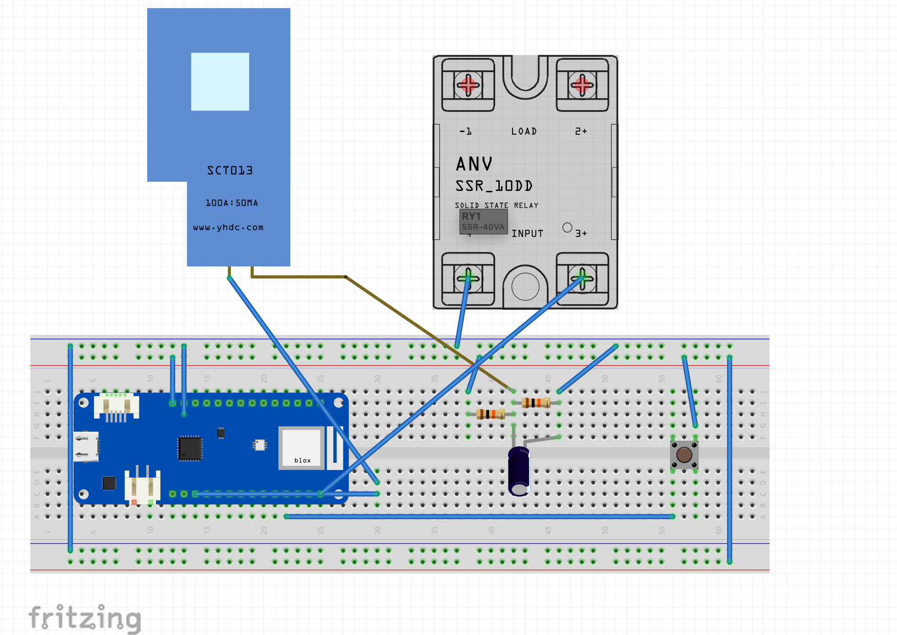

# Projet de Désactivation Automatique de Plaque à Induction

## Constat de Départ

Nous avons constaté que notre plaque à induction consomme en idle 120W en permanence. Après des recherches, il semble que toutes les plaques à induction consomment une certaine quantité d'énergie en mode idle. Cette consommation est principalement due au mécanisme de sécurité et aux capteurs tactiles qui restent actifs en attente.

## Objectif du Projet

L'objectif de ce projet est de réduire la consommation électrique de notre plaque à induction en mode idle en intégrant un mécanisme de désactivation automatique via notre système de domotique.

## Solution Proposée

Nous proposons d'utiliser notre système de domotique existant pour reconfigurer un interrupteur en cuisine, câblé en basse tension, afin d'envoyer un signal à un circuit domotique qui active un relais sur la phase 32 ampères de la plaque à induction. Voici les étapes détaillées de notre solution :

1. **Interrupteur Domotique** : Un interrupteur câblé en basse tension en cuisine envoie un signal à notre système de domotique.
2. **Activation du Relais** : Le système de domotique active un relais sur la phase 32 ampères de la plaque à induction pour permettre son utilisation.
3. **Surveillance de la Consommation** : Tant que la plaque à induction consomme plus de 120W, le relais reste ouvert.
4. **Timer de Désactivation** : Lorsque la plaque repasse à 120W, un timer de 20 minutes se déclenche. Après ces 20 minutes, le relais se ferme, désactivant ainsi la plaque à induction.

## Matériel Nécessaire

- Un interrupteur compatible avec votre système de domotique.
- Un relais capable de gérer 32 ampères.
- Un module de surveillance de la consommation électrique.
- Un système de domotique (comme Home Assistant, OpenHAB, etc.).

## Installation

1. **Configurer l'Interrupteur** : Installer l'interrupteur en cuisine et le connecter à votre système de domotique.
2. **Installer le Relais** : Connecter le relais sur la phase 32 ampères de la plaque à induction.
3. **Intégrer le Module de Surveillance** : Ajouter le module de surveillance de la consommation électrique à votre système de domotique.
4. **Configurer le Timer** : Paramétrer le timer de 20 minutes dans le système de domotique pour fermer le relais lorsque la consommation descend à 120W.

## Code Exemple

```yaml
# Exemple de configuration YAML pour Home Assistant

automation:
  - alias: 'Activer Plaque à Induction'
    trigger:
      - platform: state
        entity_id: sensor.induction_stove_power
        above: 120
    action:
      - service: switch.turn_on
        entity_id: switch.induction_stove_relay

  - alias: 'Désactiver Plaque à Induction'
    trigger:
      - platform: state
        entity_id: sensor.induction_stove_power
        below: 120
        for: '00:20:00'
    action:
      - service: switch.turn_off
        entity_id: switch.induction_stove_relay

```
# SCHEMA

